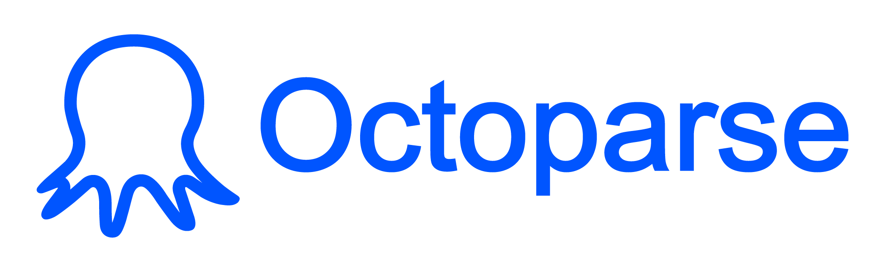

 

    <a href="https://www.octoparse.com" target="_blank">
        <picture>
            <source media="(prefers-color-scheme: dark)" srcset="./images/logo-white.png">
            
        </picture>
    </a>
     
     

<h3 align="center">Easy web scraping for anyone.</h3>

    <b>Octoparse turns websites into structured data — whether you point and click, script it, or send your AI agents.</b>
     
    <b>We're building the Data OS for enterprises and agents — one platform to collect, structure, and deliver web data.</b>

<h4 align="center">
  
  
  
  
</h4>

<h2>Web Data for Everyone 🐙</h2>

<ul>
    <li><b>Starters</b> — Grab data from popular sites instantly with ready-made scrapers in the <a href="https://www.octoparse.com/template">Template Store</a>, or build a custom scraper with auto-detect and a few clicks to confirm.</li>
    <li><b>Power users</b> — Take full control of auto-detected scrapers: fine-tune every step, then scale up with scheduling, cloud extraction, and IP rotation.</li>
    <li><b>Developers</b> — Experience Octoparse right from your stack with the <a href="https://github.com/octoparse/octoparse-cli">Octoparse CLI</a> and the <a href="https://github.com/octoparse/octoparse-mcp">MCP server</a>.</li>
    <li><b>AI agents</b> — Connect agents to real-time web data with the <a href="https://github.com/octoparse/octoparse-mcp">Octoparse MCP server</a> and <a href="https://github.com/octoparse/agent-skills">Agent Skills</a>.</li>
    <li><b>Enterprises</b> — Need data at scale, delivered? Our team handles the entire pipeline with <a href="https://www.octoparse.com/data-service">Octoparse Data Service</a>.</li>
</ul>

<h2>Learn More 🧑‍🎓</h2>

<ul>
    <li>Learn web scraping step by step at the <a href="https://helpcenter.octoparse.com/">Octoparse Help Center</a>.</li>
    <li>Read guides, use cases, and deep dives on the <a href="https://www.octoparse.com/blog">Octoparse Blog</a>.</li>
    <li>Watch tutorials on the <a href="https://www.youtube.com/c/Octoparse">Octoparse YouTube channel</a>.</li>
</ul>
