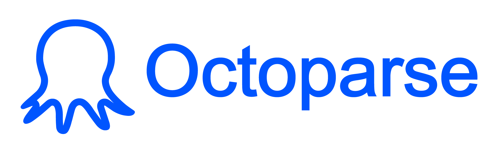

 

    <a href="https://www.octoparse.com" target="_blank">
        <picture>
            <source media="(prefers-color-scheme: dark)" srcset="./images/logo-white.png">
            
        </picture>
    </a>
     
     

<i>The merge of no-code and yes-code is almost complete.</i>

<h2 align="center">Easy web scraping for anyone</h2>

    <b>Octoparse turns websites into structured data — from ready-made scrapers to point-and-click, code, and AI agents.</b>
     
    <b>We're building the web data layer for enterprises and AI agents, with the infrastructure to back it at scale.</b>

<h4 align="center">
  
  
  
  
</h4>

<h2>Learn More About Octoparse 🐙</h2>

<ul>
    <li>Find a ready-made scraper for the site you need among 600+ in the <a href="https://www.octoparse.com/template">Octoparse Template Store</a>.</li>
    <li>Build your own without writing code in <a href="https://www.octoparse.com/download">Octoparse Desktop</a>, where auto-detect writes the selectors for you.</li>
    <li>Or just describe what you want, and let Octoparse explore the site and build the scraper.</li>
    <li>Run your tasks in the cloud — split across servers, on a schedule, with IP rotation.</li>
    <li>Drive it all from your own code with the <a href="https://www.octoparse.com/ai-open-platform">Octoparse API</a> and <a href="https://github.com/octoparse/octoparse-cli">CLI</a>.</li>
    <li>Connect your AI agents to live web data with the <a href="https://github.com/octoparse/octoparse-mcp">Octoparse MCP server</a> and <a href="https://github.com/octoparse/agent-skills">Agent Skills</a>.</li>
    <li>Scale your team's own scraping on an <a href="https://www.octoparse.com/enterprise">Enterprise</a> plan — seats, a shared console, and task assets your team owns.</li>
    <li>Or skip building altogether: <a href="https://www.octoparse.com/data-service">Data Service</a> has the Octoparse team run the whole pipeline and deliver the data to you.</li>
    <li>Learn web scraping step by step at the <a href="https://helpcenter.octoparse.com/">Octoparse Help Center</a>, or dig into the <a href="https://www.octoparse.com/docs">docs</a>.</li>
    <li>Watch tutorials on the <a href="https://www.youtube.com/@Octoparsewebscraping">Octoparse YouTube channel</a> and read deep dives on the <a href="https://www.octoparse.com/blog">Octoparse Blog</a>.</li>
</ul>
